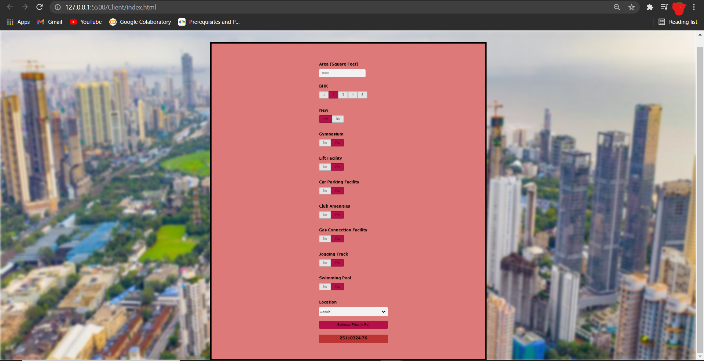

# REAL ESTATE PRICE PREDICTION

## Description
A data science effort to forecast Real Estate Price Values in Mumbai's various neighborhoods. This Python Machine Learning project is based on the Linear Regression method and uses the sklearn package. The client may pick from 90 sites across Mumbai, and the model will estimate the cost of a property in that area.

## Objectives
1.Read and analyzed the Mumbai Home Price Dataset from kaggle.com

2.Cleaned the dataset by undergoing various levels of data filtration in order to remove data anomalies,handling missing values etc.

3.Used the Sklearn Linear Regression to build the model.

4.Build a python Flask Server that uses the saved model to serve the https requests.

5.Designed an interactive UI design for the website using HTML,CSS,JS that allows user to enter house area(sqft),location etc and using python flask server user gets the estimated price.

